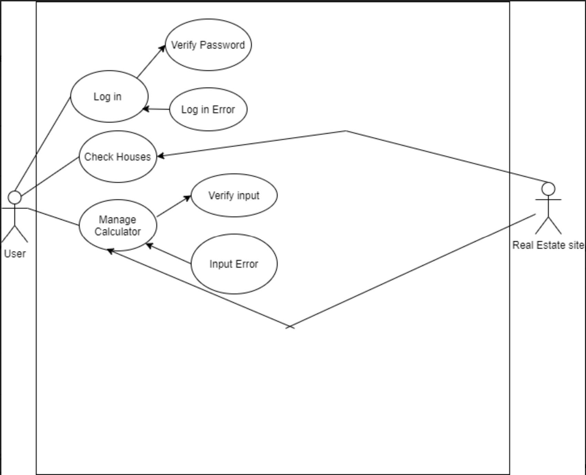
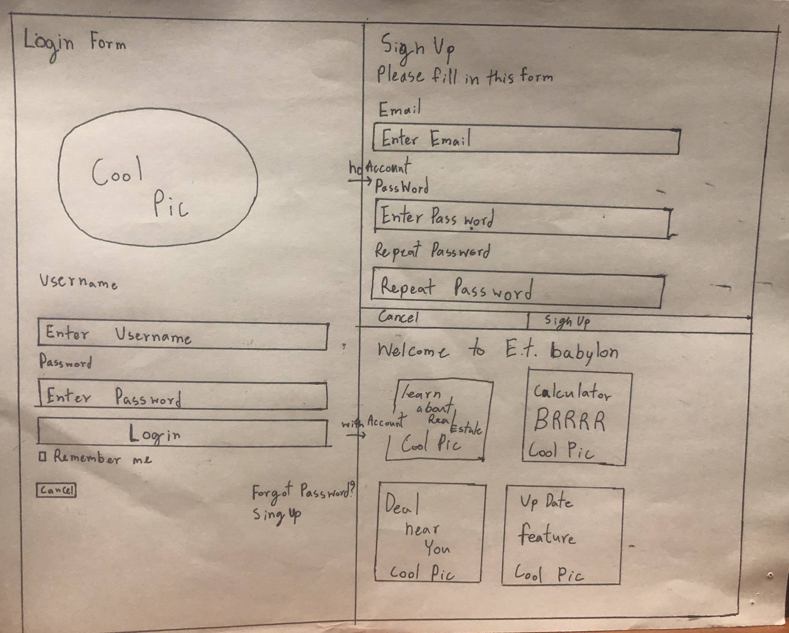
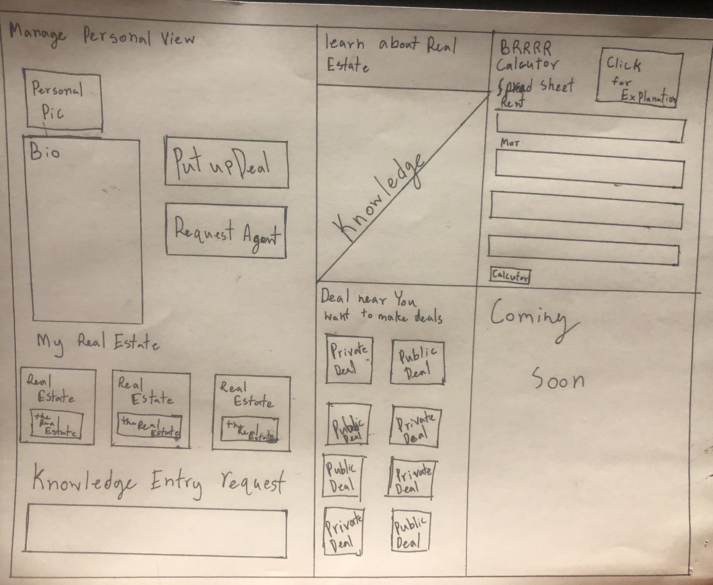
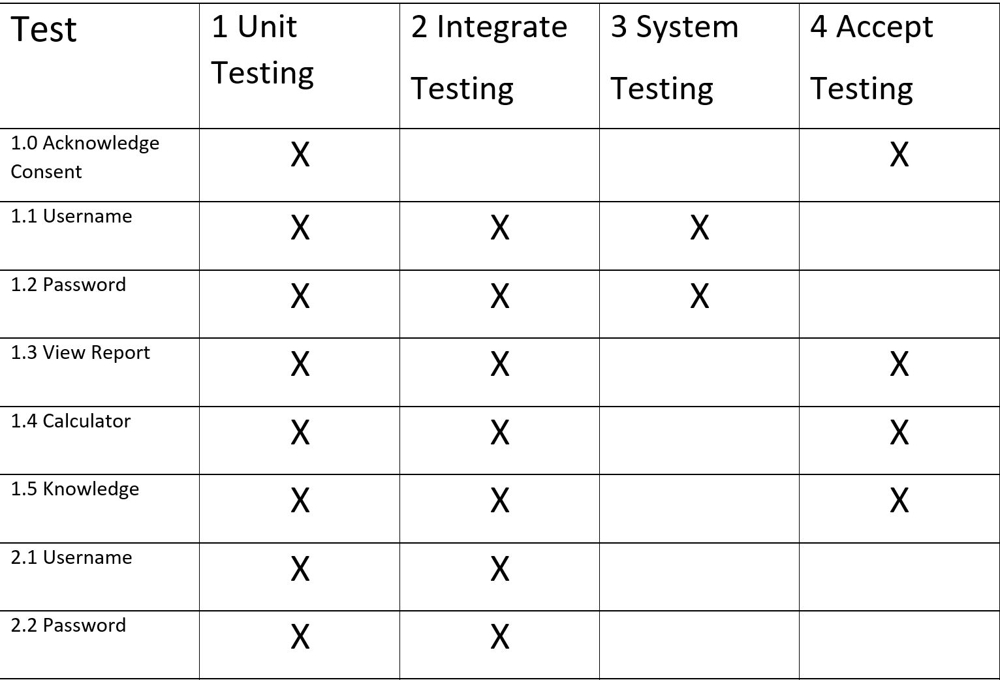
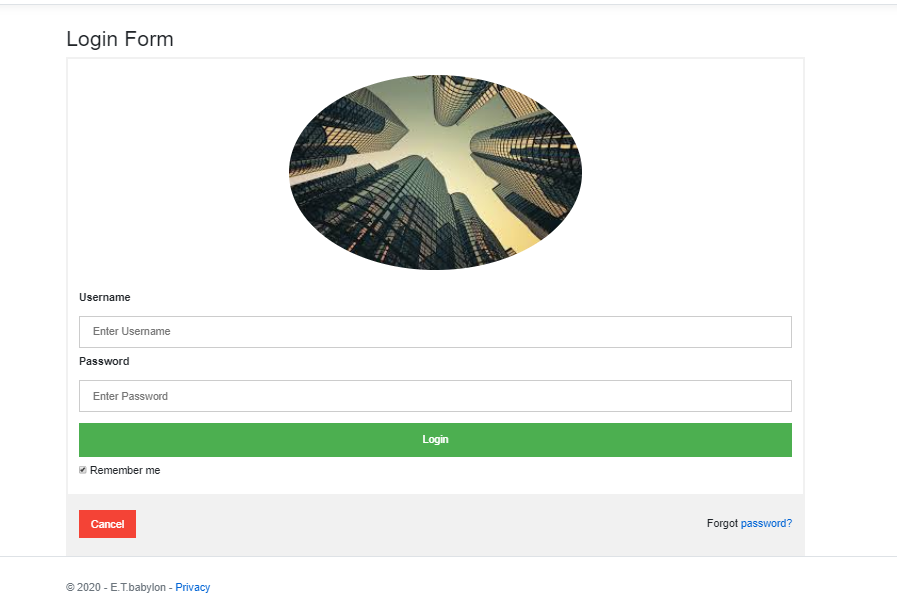
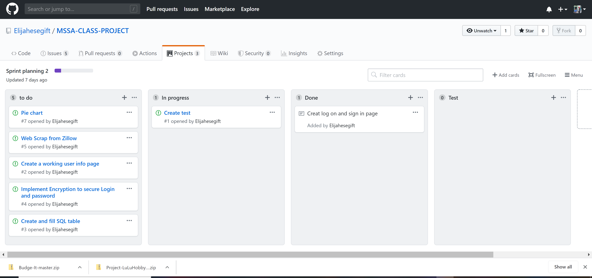
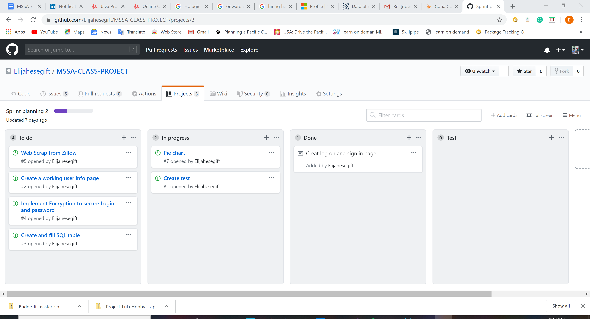

# E.T.Babylon
# Table of Content

1.  [Concept Description]
2.  [Basic feathure]
3.  [Future Feature]
4.  [User Stories]
5.  [UML]
6.  [Entity Relationship Diagram]
7.  [Wire-Frame Sketches]
8.  [Requirements]
9. [Prototype]
 
#  Concept Description

This appliction will make your real estate investing life easier. it will equip you with a real estate calculator. This app will also give you knowlage about real estates.

## Basic feature
User will be able to input or pull data from Real Estate listing website and let the user take out the information into my personnal real estate computer 

## Future feature
User will be able to add knowlege about investing and real estate. Real estate agent will also be able to add there listing.
#  User Stories
I just started to get into investing and Real Estate there is many way to invest and earn money. I want to be able to create application where people can share there investment knowlege and learn from it.
# Use Case Diagram

# Draft Entity Relationship Diagram

# initial Wirefram Sketches

## Requirments

### Requirments 1
The system shall allow users to register for accounts. The registration feature will be located on the home view. The user will enter personal information such as First Name, Last Name, Email, Date of Birth, Username and Password.

### Requirments 2
The system shall allow users will enter usernames and passwords to request the database to verify the username and password match.

### Requirments 3
The system will allow the user to edit or input the amount of money into specified account calculator space readability for the user.

### Requirments 4
The user will get a return amount of money that will be earning and needed to run property.

### Requirments 5
The user then will be taken to the knowledge and walk through step  

## test

## User

1.0 shall acknowledge consent and click the button.

1.0.1 shall click the login button.

1.1 shall enter a Username for authentication.

1.2 shall enter the assigned password with its Username

1.3 Can view reports.

1.4 Can use the calculator

1.5 can view knowledge

## System

2.0 Authenticate User

2.1 Verify input username

2.2 Verify Password match with the username

## Software

3.0 Requirement will be implemented using an online platform

3.1 List of software that will be used are the following:

3.1.1 ASP.NET

3.1.2 SQL

3.1.3 C#

3.1.4 Javascript Object Notation(JSON)

3.1.5 Hosting Platform like Mypage.com

## Testing

4.0 Test ID#1.0 inspection test for the clicked button before showing the login page.

4.1 Test ID#1.1 Use Entity Validation to check the username to match if there is an account on the database.

4.2 Test ID# 1.2 Use Entity Validation to check the password to match if there is an account on the database.

4.3 Test ID# 1.3 Verify connection with SQL server.

4.4 Test ID# 1.4 Validate all input from the database for proper assigning of maintenance codes.

# Prototype

# database

# project step 15

